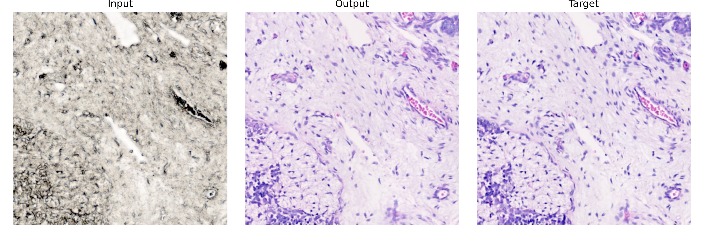

# Virtual-Staining

Paired virtual staining pipeline for histopathology images

## Overview

This repository implements an end-to-end workflow for **virtual staining in computational histopathology**. Starting from paired full-size tissue images, typically `label_free.tif` and `stained.tif`, the pipeline:

- generates tissue masks;
- aligns the stained image to the label-free reference;
- extracts paired patches and creates `dataset_train`, `dataset_val`, and `dataset_test` splits;
- trains a Pix2Pix-style conditional GAN on the resulting paired dataset.

The project therefore combines **classical image processing** and **paired deep learning**, with alignment and dataset preparation as core technical steps.

## Quick Start

### 1. Prepare input data

Create a sample folder inside `local_workspace/` containing a paired full-size sample:

```text
local_workspace/
└── your_sample/
    ├── label_free.tif
    └── stained.tif
```

### 2. Run preprocessing and dataset creation

`prepare_dataset.py` provides a CLI interface for preprocessing and dataset preparation:

```bash
python src/prepare_dataset.py <sample_path> [--seed SEED] [--save_masks] [--lang {en,it}]
```

**Example:**

```bash
python src/prepare_dataset.py local_workspace/your_sample --lang en --seed 42
```

To see all preprocessing options:

```bash
python src/prepare_dataset.py --help
```

### 3. Train the model

`pix2pix.py` supports separate CLI entry points for training and test inference:

```bash
python src/pix2pix.py train <dataset_root>
python src/pix2pix.py test <dataset_root> --checkpoint <checkpoint_path>
```

**Training example:**

```bash
python src/pix2pix.py train local_workspace/your_sample
```

To see all training options:

```bash
python src/pix2pix.py train --help
```

### 4. Run test inference

Provide the checkpoint explicitly from the command line:

```bash
python src/pix2pix.py test local_workspace/your_sample --checkpoint local_workspace/your_sample/checkpoints/your_checkpoint.pth
```

To see all test options:

```bash
python src/pix2pix.py test --help
```

**Note**: the training and test workflow is now CLI-driven. Outputs such as logs, checkpoints, validation previews, and test predictions are created automatically inside the selected dataset root.

## Qualitative Results

The figures below are static qualitative examples included for documentation and visual inspection.

Each panel compares:

- input label-free patch;
- generated stained prediction;
- real stained target.




## Current Workflow

The current executable workflow is concentrated in two scripts inside [`src/`](./src):

1. [`src/prepare_dataset.py`](./src/prepare_dataset.py)  
   Preprocessing pipeline for mask generation, alignment, patch extraction, and dataset split creation.
2. [`src/pix2pix.py`](./src/pix2pix.py)  
   Training and inference script for a Pix2Pix-style paired image-to-image translation model.

Workflow summary:

1. Provide paired full-size histology images.
2. Generate masks and isolate useful tissue regions.
3. Align the stained image to the label-free image.
4. Extract aligned patches.
5. Split patches into `dataset_train`, `dataset_val`, and `dataset_test`.
6. Train the model and save checkpoints and validation outputs.
7. Run test-time inference on held-out data.

## Repository Structure

The repository includes both the current workflow and older experimental material accumulated during development. For day-to-day use, the main entry point is `src/`.

```text
Virtual-Staining/
├── archive/
├── docs/
├── examples/
├── local_workspace/
├── src/
│   ├── json/
│   ├── prepare_dataset.py
│   └── pix2pix.py
├── requirements.txt
└── README.md
```

Main paths:

- `src/` contains the main executable code.
- `src/prepare_dataset.py` handles preprocessing and dataset creation.
- `src/pix2pix.py` handles training, validation, checkpoints, and test inference.
- `src/json/` contains support configuration and message files.
- `local_workspace/` is the working area used during execution, where input samples and execution-generated folders such as datasets, checkpoints, logs, and output images are stored.
- `docs/` contains project documentation and static assets used in the README or related explanatory material.
- `examples/` contains example images or sample materials useful to illustrate the pipeline and its outputs.
- `archive/` contains historical notes, experiments, and legacy working material collected during development.

## Main Scripts

### `src/prepare_dataset.py`

Integrated preprocessing entry point.

**What it does**

- loads `label_free.tif` and `stained.tif` from a given folder;
- computes foreground masks for both images;
- aligns the stained image to the label-free reference;
- extracts patch pairs from aligned tissue regions;
- saves the resulting dataset into `dataset_train/`, `dataset_val/`, and `dataset_test/`.

**CLI usage**

```bash
python src/prepare_dataset.py <path> [--seed SEED] [--save_masks] [--lang {en,it}]
```

To see all available options:

```bash
python src/prepare_dataset.py --help
```

**Typical outputs**

- `mask_lf.tif`
- `mask_st.tif`
- `aligned_stained.tif`
- `aligned_mask_st.tif`
- `subimages/`
- `dataset_train/`
- `dataset_val/`
- `dataset_test/`

When `--save_masks` is enabled, patch-level mask files are also saved inside `subimages/`.

### `src/pix2pix.py`

Learning and inference stage of the pipeline.

**What it does**

- loads paired patch datasets using the naming convention `*_label_free.tif` and `*_stained.tif`;
- trains a Pix2Pix-style conditional GAN;
- validates the model during training;
- saves checkpoints;
- runs test-time inference from a selected checkpoint.

**CLI usage**

```bash
python src/pix2pix.py train <dataset_root>
python src/pix2pix.py test <dataset_root> --checkpoint <checkpoint_path>
```

To see all available options:

```bash
python src/pix2pix.py --help
python src/pix2pix.py train --help
python src/pix2pix.py test --help
```

**Practical note**: logs, checkpoints, validation outputs, and test outputs are automatically created inside the selected dataset root.

## Input and Outputs

**Expected preprocessing input**:

- `label_free.tif`
- `stained.tif`

**Expected training/testing pairs**:

- `00000_00000_label_free.tif`
- `00000_00000_stained.tif`

Only valid prefix-matched pairs are used by the dataset loader.

**Typical generated artifacts**:

- masks for both input images;
- aligned stained image artifacts;
- extracted paired patches in `subimages/`;
- dataset splits in `dataset_train/`, `dataset_val/`, and `dataset_test/`.
- validation predictions;
- saved checkpoints;
- test predictions.

## Method

The pipeline combines deterministic image processing with paired supervised deep learning.

**Preprocessing**

- mask generation isolates tissue regions and reduces background-dominated areas;
- alignment registers the stained image to the label-free reference using feature-based matching and affine transformation;
- patch extraction divides aligned images into fixed-size patches while filtering mostly background regions.

**Learning model:**

- Pix2Pix-style conditional GAN trained on paired histology patches;
- U-Net-like generator with skip connections;
- PatchGAN discriminator on conditional image pairs;
- adversarial supervision combined with reconstruction loss.

This setup is suitable for paired image-to-image translation, where the generated stained image should remain structurally consistent with the input label-free image.

## Requirements

The project currently targets:

- **Python 3.11**

Main libraries used in the codebase include:

- OpenCV
- NumPy
- Pillow
- PyTorch
- torchvision
- Matplotlib

The repository includes a minimal [`requirements.txt`](./requirements.txt), but dependency management is still lightweight and may require manual package installation depending on the environment.

## Detailed Usage

**Preprocessing:**

```bash
python src/prepare_dataset.py local_workspace/liver --lang en --seed 42 --save_masks
```

**Training:**

```bash
python src/pix2pix.py train local_workspace/liver
```

**Testing/Inference:**

```bash
python src/pix2pix.py test local_workspace/liver --checkpoint local_workspace/liver/checkpoints/your_checkpoint.pth
```

For test inference, provide the checkpoint path explicitly with `--checkpoint`.

## Limitations/Current State

The project is structured and usable, but still experimental in several practical respects.

- The workflow is now CLI-driven, but configuration is still only partially centralized.
- The repository includes historical material alongside the current main workflow.
- Dependency management is minimal and not yet tightly pinned.

## Future Improvements

Planned or plausible directions for improvement include:

- centralized configuration for paths and hyperparameters;
- more consistent CLI design and centralized configuration;
- stronger reproducibility and dataset bookkeeping;
- more modular separation of preprocessing, training, and evaluation code;
- expanded evaluation and visualization utilities.

## Academic Context

This project was developed in a university and research-oriented setting focused on **virtual staining**, **computational histopathology**, and **paired image-to-image translation**. It reflects both the methodological importance of aligned supervision and the practical engineering work required to transform full-size microscopy images into training-ready paired data.
