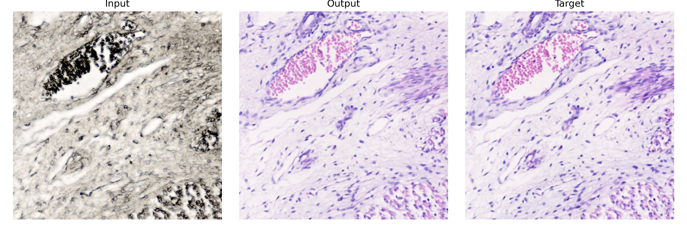
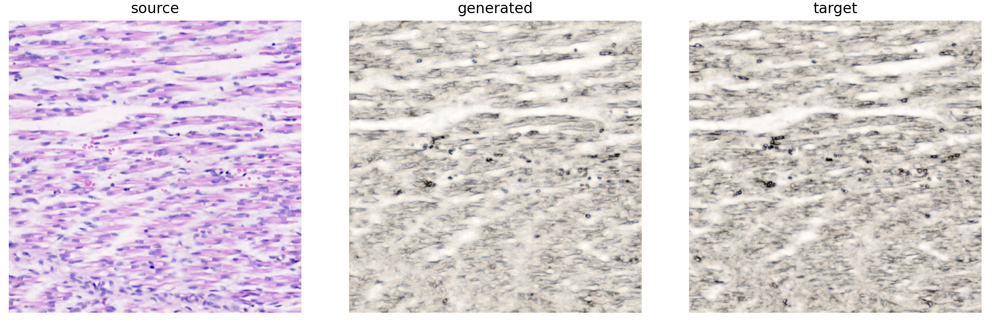

# Virtual Staining

Research portfolio project for virtual staining of histopathology images using a Pix2Pix conditional GAN.

The pipeline trains a paired image-to-image translation model on aligned histology patch pairs, enabling
generation of virtually stained images from label-free microscopy inputs (and vice versa).

## CLI Commands

| Command | Purpose |
|---|---|
| `vs prepare` | Build the patch dataset from full-size image pairs |
| `vs run` | Run the complete pipeline or selected stages |
| `vs train` | Train the Pix2Pix model |
| `vs infer` | Run inference on the test split |
| `vs infer-images` | Run inference on one image file or a directory of images |
| `vs evaluate` | Evaluate a configured run or one image pair |
| `vs compare` | Compare metric distributions across runs |
| `vs panels` | Build source / generated / target comparison panels |
| `vs organize` | Organise run outputs |
| `vs queue` | Execute full or staged runs sequentially from a queue file |

## Quick Start

```bash
# 1. Enter the Nix environment
nix develop

# 2. Install dependencies
uv sync --frozen

# 3. Copy and edit the example run config
cp config/runs/example.yaml config/runs/local/my_run.yaml

# 4. Run the full pipeline
vs run --config config/runs/local/my_run.yaml
```

### Development commands

```bash
make sync
make format
make lint
make typecheck
make test
make qa
make clean
```

Or call the CLI directly:

```bash
vs run --config config/runs/local/my_run.yaml
vs run --config config/runs/local/my_run.yaml --stages train infer evaluate
```

Evaluate one generated image without adding another top-level command:

```bash
vs evaluate --pair target.png target_generated.png --output-dir evaluation
```

Run inference on one image or a directory:

```bash
vs infer-images \
  --config config/runs/local/my_run.yaml \
  --input examples \
  --output local_workspace/results/my_run/example_outputs
```

`vs infer-images` accepts `.bmp`, `.jpg`, `.jpeg`, `.png`, `.tif`, and `.tiff`.
It defaults to `--mode auto`: patch-sized inputs use the standard single-patch
path, while larger images are processed tile-by-tile and saved at the original
size. Use `--mode resize` to force the resizing of the whole input to
`image_size`. Use `--output-format png` to force a common output format
for directory batches.

Queue multiple full or partial pipeline runs locally:

```yaml
# config/queues/nightly.yaml
name: nightly
continue_on_failure: true
jobs:
  - config_path: ../runs/local/run_a.yaml
    label: baseline
  - config_path: ../runs/local/run_b.yaml
    stages: [train, infer, evaluate]
    notes: retry with lower lr
```

```bash
vs queue --queue config/queues/nightly.yaml
```

Omit `stages` to run the full `prepare`, `train`, `infer`, `evaluate`
sequence. When `stages` is present, allowed values are `prepare`, `train`,
`infer`, and `evaluate`, executed in the order listed.

Queue definitions live under `config/queues/`. Personal queue YAMLs can live
under `config/queues/local/`. Queue runtime state is written under
`local_workspace/queues/`, separate from the committed queue definitions.
State files are flat in that directory, for example
`local_workspace/queues/nightly.state.json`.

For controlled ablations, add an optional `ablation` block to the queue. The
queue preflight compares resolved configs and fails before training if a field
differs outside the declared `variable_fields`. Summary metadata is written to
`local_workspace/queues/<queue-name>.ablation.summary.json`.

## Configuration

All experiment parameters live in a single YAML file. Copy
[`config/runs/example.yaml`](config/runs/example.yaml) and edit it:

```yaml
dataset_root: local_workspace/datasets/your_sample
results_path: local_workspace/results
run_name: your_run_name

# [width, height] - e.g. [320, 256] means 320 px wide, 256 px tall
image_size: [256, 256]

preprocessing:
  source_name: label_free.tif
  target_name: stained.tif
  # For very large local TIFF/PNG/JPEG/BMP inputs, read previews and patch
  # regions on demand instead of keeping full-resolution images resident.
  # tiled_io: true
  # mask_scale: 0.25
  train_ratio: 0.80
  val_ratio: 0.05
  test_ratio: 0.15
  min_foreground_ratio: 0.25
  save_discarded_patches: false
  seed: 42

training:
  batch_size: 8
  epochs: 100
  lr_g: 0.0002
  seed: 42
  augmentation:
    enabled: false
    expansion_factor: 1
    intensity: light
  losses:
    generator:
      - name: l1
        weight: 25.0
    discriminator:
      - name: adversarial_bce
        weight: 1.0

inference:
  checkpoint_policy: latest   # or: checkpoint_path: checkpoints/ep099.pth

evaluation:
  save_graphs: true
```

Experiment commands accept YAML configuration directly through `--config`.

See [`docs/architecture.md`](docs/architecture.md) for the full config schema and
[`docs/run_format.md`](docs/run_format.md) for run output layout.

## Qualitative Results

Each panel compares source patch, generated target, and real target.

From label-free to H&E staining:


From H&E staining to label-free:


## Package Structure

- `utils/` - shared primitives: dimensions, image I/O, metrics helpers
- `config/` - YAML loading, validation, typed config sections
- `experiment/` - run concept: RunPaths, RunMetadata, environment snapshots
- `models/` - UNetGenerator, PatchGANDiscriminator, model config
- `data/` - dataset, manifest, builder, preprocessing pipeline
- `training/` - Trainer, runner, steps, losses, checkpoint management
- `inference/` - Predictor, runner, output writers
- `evaluation/` - metrics, evaluator, summaries, panels, ranking
- `applications/` - use-case orchestrators (no argparse)
- `cli/` - thin argparse entrypoints delegating to `applications/`

See [`docs/architecture.md`](docs/architecture.md) for the full description and layer boundaries.

## Repository Structure

```text
Virtual-Staining/
├── config/
│   ├── queues/                 # queue YAML files (example.yaml template)
│   └── runs/                   # run YAML files (example.yaml template)
├── docs/
│   ├── assets/                 # qualitative result images
│   ├── notebooks/
│   └── reports/
├── examples/                   # example input images
├── local_workspace/
│   ├── datasets/               # input paired samples (gitignored)
│   ├── queues/                 # queue state files (gitignored except .gitkeep)
│   └── results/                # run outputs (gitignored)
├── tests/                      # pytest suite grouped by subsystem
│   ├── cli/
│   ├── config/
│   ├── data/
│   ├── evaluation/
│   ├── experiment/
│   ├── inference/
│   ├── models/
│   ├── smoke/
│   ├── training/
│   └── utils/
├── virtual_staining/           # installable package
│   ├── applications/           # use-case orchestrators
│   ├── cli/                    # argparse entry points
│   ├── config/
│   ├── data/
│   ├── evaluation/
│   ├── experiment/
│   ├── inference/
│   ├── models/
│   ├── training/
│   └── utils/
├── Makefile
├── flake.nix
├── pyproject.toml
└── uv.lock
```

## Development

```bash
# Inside nix develop shell:
make qa
# Equivalent to:
uv run ruff check .
uv run ruff format --check .
uv run pyright
uv run --group dev pytest
```

The test layout is documented in [`tests/README.md`](tests/README.md).

### Pre-commit hooks

Install the hooks once per clone:

```bash
nix develop -c pre-commit install
```

Run them manually across the repository:

```bash
nix develop -c pre-commit run --all-files
```

Other useful commands:

```bash
make format       # apply ruff formatting
make lint         # ruff lint check
make typecheck    # pyright only
make test         # pytest only
make sync         # reinstall from uv.lock
uv lock           # re-resolve dependencies
```

## Data Split Caveat

The default split is **patch-level**: train, validation, and test patches are all drawn
from the same slide. Metrics on `splits/test/` measure same-slide internal validation,
not independent generalization. For generalizability evidence, use a slide-level,
patient-level, or spatial-block split strategy - the current pipeline does not implement
these.

## Method

- **Preprocessing** - tissue masking, feature-based affine alignment of target to source,
  patch extraction with foreground and white-area quality filters.
- **Model** - Pix2Pix conditional GAN: U-Net generator with skip connections and
  PatchGAN discriminator, trained with adversarial loss + L1 reconstruction loss.
- **Evaluation** - per-image MAE, RMSE, PSNR, SSIM; summary statistics; optional
  comparison panels with difference maps.

## License

Released under the **MIT License**. See [`LICENSE`](./LICENSE) for details.
