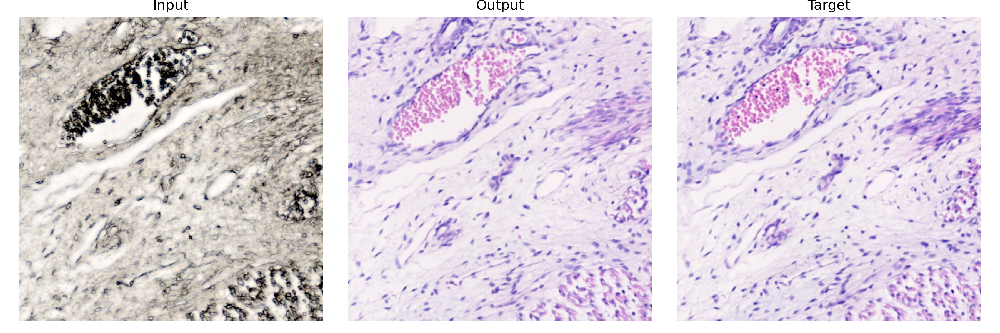
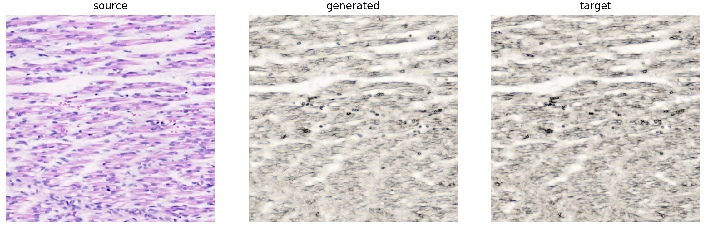

# Virtual Staining

Experimental, reproducible image-translation framework focused on virtual staining of
histopathology images: generating stained-looking images from label-free microscopy inputs
(and vice versa).

Two translation methods are built in:

- **Pix2Pix** (reference method): paired training on aligned patches, with N ordered
  named RGB inputs and M ordered named RGB outputs.
- **CycleGAN**: unpaired training between one source domain and one target domain,
  with `A_to_B` and `B_to_A` inference from the same checkpoint.

The run config selects the method with `method.name`. The stock CLI supports these
built-ins; Python callers can supply
[explicit method and component definitions](docs/library_api.md#extending-with-explicit-definitions).

## CLI Commands

| Command | Purpose |
|---|---|
| `vs prepare` | Build patches from paired slide sets or two independent raw-image domains |
| `vs run` | Run the complete pipeline or selected stages |
| `vs train` | Train the configured built-in method |
| `vs infer` | Run inference on the test split (CycleGAN: in the configured direction) |
| `vs infer-images` | Run inference on one image file or a directory of images |
| `vs evaluate` | Paired image metrics or unpaired collection diagnostics for a run, or metrics for one image pair |
| `vs compare` | Compare metric distributions across runs |
| `vs convert` | Convert TIFF/PNG/JPEG images to OpenSlide-compatible pyramidal BigTIFFs |
| `vs panels` | Build source / generated / target comparison panels |
| `vs organize` | Organise run outputs |
| `vs export-model` | Export selected run checkpoints as a portable local model bundle |
| `vs queue` | Execute full or staged runs sequentially from a queue file |
| `vs config` | Print the resolved config, or check it (optionally read-only asset preflight) without running a stage |
| `vs inventory` | Preview or write raw paired slide sets or unpaired domain inventories |
| `vs status` | Check required Python/native dependencies, system memory, and GPU support |

## Quick Start

```bash
# 1. Enter the Nix environment
nix develop

# 2. Install the mandatory Python dependencies
uv sync --frozen

# 3. Copy and edit a run config (minimal starter; config/runs/example.yaml is the
#    fully annotated reference of every option)
cp config/runs/minimal_pix2pix.yaml config/runs/local/my_run.yaml

# 4. Check it without running anything (add --assets for read-only input checks)
uv run vs config check --config config/runs/local/my_run.yaml --stages prepare train infer evaluate

# 5. Run the full pipeline
uv run vs run --config config/runs/local/my_run.yaml
```

The supported runtime is the Nix development shell. `uv sync --frozen` installs
all mandatory Python dependencies, including OpenSlide Python and pyvips; no WSI
extra is needed. The shell supplies native OpenSlide and libvips on Linux and
macOS, including library search paths for Python FFI loading. Run pipeline and
development commands inside this shell (or with `nix develop -c ...`).
The remaining `vs` examples assume `.venv` is activated; otherwise use `uv run vs`.

`uv run vs status` checks required Python imports and native WSI library usability.
A missing or broken required dependency produces a failing status. NVIDIA drivers,
CUDA devices, and GPU availability are optional; a CPU-only runtime can be healthy.

### Other CLI examples

Convert TIFF, PNG or JPEG files, or mixed directories recursively, to lossless pyramidal
BigTIFFs. Extensions are case-insensitive. Directory inputs keep their relative layout;
an output subtree inside an input directory is excluded:

```bash
vs convert raw/source.tif raw/stain.png raw/photo.jpg --output-dir converted
vs convert raw/slides --output-dir converted
```

PNG/JPEG names become `.tif`; TIFF names keep their suffix. Multiple inputs mapping to
the same destination (for example, `sample.png` and `sample.jpg`), repeated source
selections and existing destinations are rejected before conversion. A destination
created concurrently is never overwritten. Publication requires same-filesystem hard
links; unsupported filesystems fail without a replacement fallback.

PNG/JPEG conversion accepts 8-bit RGB and grayscale, plus binary/grayscale and palette
PNGs expanded to RGB. Alpha/transparency (even opaque alpha), higher bit depths such as
16-bit PNG, CMYK JPEG and animated PNG are rejected. Valid EXIF orientation is applied;
invalid orientation, malformed/truncated images and decoder metadata warnings are
rejected. Encoded color values are preserved without ICC/gamma color correction;
unrelated metadata, including stale EXIF dimensions, is discarded. Ordinary DPI is
not calibrated microscopy spacing: output MPP remains unknown. Lossless TIFF encoding
does not recover detail already lost in JPEG compression. Existing TIFF conversion
behavior is unchanged.

Export selected checkpoints of a finished run, with their exact tracked training
configs, as a verified local bundle that can be moved and reconstructed without the
original run or dataset:

```bash
vs export-model \
  --run-path local_workspace/results/my_run \
  --output local_workspace/bundles/my_run \
  --best val_ssim__HE --top-k val_ssim__HE 2 --latest
```

Selection options and the portable artifact contract are documented in
[Model Bundles](docs/run_format.md#model-bundles).

Evaluate one generated image without adding another top-level command:

```bash
vs evaluate --pair sample_target.png generated/HE/sample_generated.png --output-dir evaluation
```

Run inference on named inputs, or use `--input PATH` for a single-input model:

```bash
vs infer-images \
  --config config/runs/local/my_run.yaml \
  --input AF=examples/sample_af.png \
  --input LF=examples/sample_lf.png \
  --output local_workspace/results/my_run/example_outputs
```

Inputs must already be spatially registered and have identical pixel dimensions.
Directory inputs are also supported, with `--recursive` for subdirectories. The default
`auto` mode tiles images whose dimensions differ from the configured patch size; `--mode resize` forces
one resized prediction. See [inference inputs and modes](docs/library_api.md#direct-predictor-inference)
and [generated artifacts](docs/run_format.md#generated-images) for the complete contracts.

Queue full or partial pipeline runs sequentially:

```bash
vs queue --queue config/queues/example_operations.yaml  # separate operation YAML files
vs queue --queue config/queues/example_full.yaml        # default full pipeline per job
```

All job configs must satisfy their selected stages before the first job executes.
Omitted job stages require the full four-stage pipeline. Queues preserve run-config path
bases; job `config_path` is relative to the queue file.

[Queue configuration](config/queues/example.yaml) and
[controlled ablations](config/queues/example_ablation.yaml) document the supported
options; [queue state](docs/run_format.md#local-queues) lives under `local_workspace/queues/`.

## Configuration

All experiment parameters live in a single YAML file. Start from a short starter,
[`config/runs/minimal_pix2pix.yaml`](config/runs/minimal_pix2pix.yaml) or
[`config/runs/minimal_cyclegan.yaml`](config/runs/minimal_cyclegan.yaml). The annotated
references [`config/runs/example.yaml`](config/runs/example.yaml) (Pix2Pix) and
[`config/runs/example_cyclegan.yaml`](config/runs/example_cyclegan.yaml) (CycleGAN) are
the same experiments with every supported option, default, and path base written out.
Experiment commands accept YAML configuration through `--config`. Each selected operation
requires only the settings it consumes; see the [requirement matrix and minimal operation
examples](docs/library_api.md#selected-operation-configuration). Prepare-only YAML needs no
method, model, training, results directory, or run name.

### Inspecting and checking a config

```bash
vs config check --config config/runs/minimal_prepare.yaml --stages prepare
vs config resolve --config config/runs/minimal_prepare.yaml --stages prepare
vs config check --config config/runs/minimal_train.yaml --stages train
vs config check --config config/runs/minimal_infer.yaml --stages infer
vs config check --config config/runs/minimal_evaluate.yaml --stages evaluate
vs config resolve --config config/runs/minimal_train_infer.yaml --stages train infer
vs config resolve --config my_run.yaml --stages train --output resolved.yaml  # never overwrites
vs config check --config my_run.yaml --stages prepare train infer evaluate --assets
```

Both commands validate the union of explicit `--stages` requirements through the same
resolver used by execution. Without `--stages`, they inspect supplied configuration only;
success does not certify any execution. Stages are never inferred from present sections.
Resolve writes canonical YAML to stdout (scope to stderr); check reports scope and the
same resolved SHA-256. Use the same stages and order as execution for matching snapshots.
Omitted prepare-only method, model and run fields stay absent.
For independent domains, use [minimal_unpaired_prepare.yaml](config/runs/minimal_unpaired_prepare.yaml)
and a hand-authored `domain,path` inventory. The [unpaired preparation contract](docs/dataset_format.md#independent-unpaired-preparation)
explains real group IDs, conditional mask policies, immutable output builds and consumer setup.
A runnable software example is [examples/unpaired/prepare.yaml](examples/unpaired/prepare.yaml);
its patch split makes no biological-independence claim.
The [grouped CSV/YAML template](docs/dataset_format.md#grouped-preparation-template-for-your-data)
shows patient, specimen and set identifiers and explains all four split options for your data.

`--assets` adds read-only checks for explicitly selected stages; it selects no stages,
does not verify content, freeze inputs, or certify scientific validity. Earlier selected
producers yield `planned` checks, not verified artifacts. Configuration-only inspection
needs no image, dataset or checkpoint access. See
[config inspection and preflight](docs/library_api.md#inspecting-and-checking-configs).

### Authoring raw inventories

```bash
vs inventory preview --dataset-root DATASET \
  --input LF=raw/LF --input 'AF=raw/AF/**/*.svs' \
  --target HE=raw/HE --target PAS=raw/PAS --reference LF
vs inventory write ...   # publishes DATASET/inputs/slide_sets.csv; never overwrites
```

Mappings match files by relative path; alignment and biological IDs are never inferred.
For two independent raw domains, use explicit unpaired mode (unequal counts are allowed):

```bash
vs inventory preview --pairing unpaired --dataset-root DATASET \
  --domain LF=raw/LF --domain 'HE=raw/HE/**/*.tif'
vs inventory write --pairing unpaired --dataset-root DATASET \
  --domain LF=raw/LF --domain 'HE=raw/HE/**/*.tif' --output inputs/paths.csv
```

Optional `--metadata metadata.csv` supplies IDs and masks by exact root-relative `path`;
IDs are never inferred. The resulting `paths.csv` feeds normal unpaired `vs prepare`.
See [raw domain authoring and preparation](docs/dataset_format.md#authoring-independent-raw-domains).

The complete [inventory authoring contract](docs/dataset_format.md#authoring-the-inventory)
covers keys, metadata, masks, and safe publication.

See [dataset formats](docs/dataset_format.md), [run artifacts](docs/run_format.md),
[Python APIs](docs/library_api.md), [architecture](docs/architecture.md), and
[reproducibility](docs/reproducibility.md) for the deeper contracts.

## Qualitative Results

Pix2Pix results. Each panel compares source patch, generated target, and real target.

From label-free to H&E staining:


From H&E staining to label-free:


## Repository Structure

| Location | Contents |
|---|---|
| `config/` | Run and queue YAML references and starters |
| `virtual_staining/` | Installable package; see [architecture](docs/architecture.md) |
| `tests/` | Test suite; see [test layout](tests/README.md) |
| `docs/` | Contracts, notebooks, reports, and qualitative result assets |
| `examples/` | Example input images |
| `local_workspace/` | Local datasets, queue state, and run outputs (gitignored) |

## Development

```bash
# Inside nix develop shell:
make qa
```

The test layout is documented in [`tests/README.md`](tests/README.md).

### Pre-commit hooks

Install the hooks once per clone:

```bash
nix develop -c pre-commit install
```

Run them manually across the repository:

```bash
nix develop -c pre-commit run --all-files
```

Other useful commands:

```bash
make format       # apply ruff formatting
make lint         # ruff lint check
make typecheck    # pyright only
make test         # pytest only
make sync         # reinstall from uv.lock
uv lock           # re-resolve dependencies
```

## Data Split Caveat

The default split is **patch-level**: train, validation, and test patches may be drawn
from the same slide. For independent generalization evidence, configure `split.unit` as
`set`, `specimen`, or `patient`; spatial-block splitting is not implemented.

## Method

Paired preprocessing masks tissue, aligns targets to a reference, and extracts patches
on a shared grid with foreground and white-area filters. Pix2Pix learns from these
aligned samples; CycleGAN learns from independent domain collections.

Evaluation supports paired image metrics against aligned references and unpaired
collection diagnostics. Results remain separate for every output; unpaired evaluation
requires a one-output model. See [evaluation outputs](docs/run_format.md#evaluation-outputs)
for report semantics and [run references](config/runs/example.yaml) for configuration.

### Scientific scope

Paired image metrics are meaningful only against spatially aligned references. CycleGAN's
unpaired diagnostics compare low-order appearance statistics of two image collections;
they do not measure sample-level fidelity and do not establish biological correctness or
clinical validity. A synthetic multi-output run proves only the software contract,
not biological benefit. Nothing in this repository is validated for clinical use.

## License

Source code is covered by the **MIT License**; see [`LICENSE`](./LICENSE).
Repository visual assets covered by [`ASSETS_LICENSE.md`](ASSETS_LICENSE.md) follow
that separate notice and are not covered by MIT.
